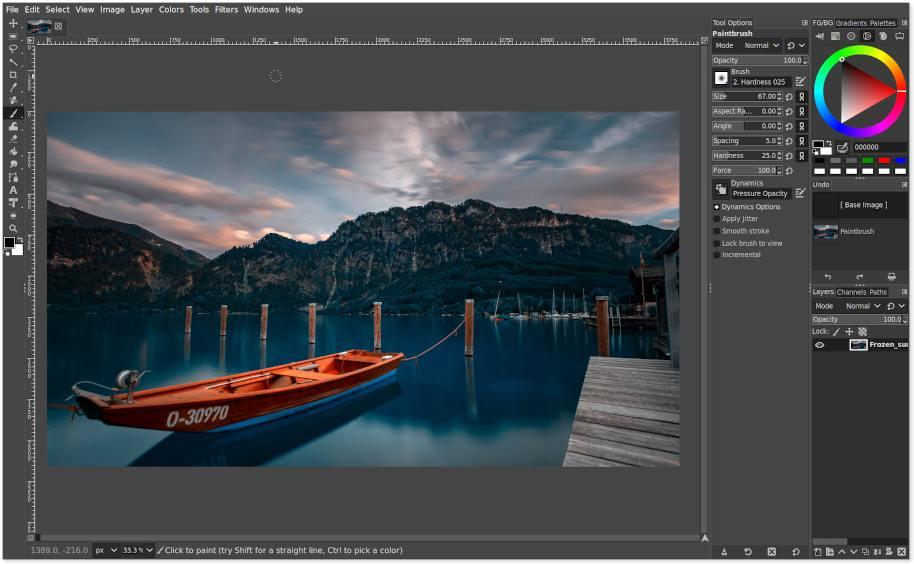

[![Contributors][contributors-shield]][contributors-url]
[![Forks][forks-shield]][forks-url]
[![Stargazers][stars-shield]][stars-url]


<!-- PROJECT LOGO -->
<br />
<p align="center">
  <a href="https://github.com/Gimptoshop/Gimptoshop">
    
  </a>

  <h3 align="center">Gimptoshop</h3>

  <p align="center">
gimp with similar Adobe Photoshop shortcuts, UI layout and tool behavior
  <br />
    <a href="https://github.com/Gimptoshop/Gimptoshop/issues">Report Bug</a>
    ·
    <a href="https://github.com/Gimptoshop/Gimptoshop/issues">Request Feature</a>
  </p>
</p>

 

<!-- ABOUT THE PROJECT -->
## About The Project

### Prerequisites

First, you need to install Gimp 2.10 or later version.
Go to the App Store or your operating system or download it from [the gimp official website](https://www.gimp.org/downloads/).

Next you need git installed on your machine.

```sudo apt update
sudo apt upgrade
sudo apt install git
```
## Installation

 #### Linux
 1. Install git on your system if not arleady done
  2.  Download the .zip file from that page
3.  Right-click on uninstall.sh in the /tools folder
   4. Select Properties
   5. Select Permissions
   6. Select Allow executing file as a program
   7. Drag the file in the terminal and press Enter

 #### Windows (not tested)
  1.  Download the .zip file from the repository
   2.  Delete the `gimp` folder  inside `C:\Program Files\GIMP 2\share\`
 3.  Copy the previously done backup an rename it `gimp` inside `C:\Program Files\GIMP 2\share\`

  #### Mac (not tested)
   1.  Delete the `gimp` folder  inside `Users/your-username/Library/GIMP/`
 2.  Copy the previously done backup an rename it `gimp` inside `Users/your-username/Library/GIMP/`

## Uninstall
#### Linux

 This patch has been tested only with snap package and on Linux OS. Use at your own risk with others sources or OS

The script uninstall.sh  will automatically uninstall  the patch

Copy this line in your terminal :

1. Install git on your system if not arleady done
 2.  Download the .zip file from that page
3.  Right-click on uninstall.sh in the /tools folder
  4. Select Properties
  5. Select Permissions
  6. Select Allow executing file as a program
  7. Drag the file in the terminal and press Enter

 #### Windows (not tested)
  1.  Download the .zip file from the repository
   2.  Delete the `gimp` folder  inside `C:\Program Files\GIMP 2\share\`
 3.  Copy the previously done backup an rename it `gimp` inside `C:\Program Files\GIMP 2\share\`

  #### Mac (not tested)
   1.  Delete the `gimp` folder  inside `Users/your-username/Library/GIMP/`
 2.  Copy the previously done backup an rename it `gimp` inside `Users/your-username/Library/GIMP/`


<!-- ROADMAP -->
## Roadmap

See the [open issues](https://github.com/Gimptoshop/Gimptoshop/issues) for a list of proposed features (and known issues).


<!-- CONTRIBUTING -->
## Contributing

Contributions are what make the open source community such an amazing place to be learn, inspire, and create. Any contributions you make are **greatly appreciated**.

1. Fork the Project
2. Create your Feature Branch (`git checkout -b feature/AmazingFeature`)
3. Commit your Changes (`git commit -m 'Add some AmazingFeature'`)
4. Push to the Branch (`git push origin feature/AmazingFeature`)
5. Open a Pull Request

<!-- ACKNOWLEDGEMENTS -->
## Acknowledgements


* [Gimptoshop icon](https://github.com/trenta-io/trenta-icons) by Kev Doyle
* [Splash screen](https://www.pling.com/p/1009041/) by Valentine A.
* [UI layout, tool behavior, and shortcuts adaptation](https://github.com/BenShoeman/gimp-photoshop-profile) by Ben Shoeman
* [install script, UI layout, tool behavior, and shortcuts adaptation](https://github.com/doctormo/GimpPs) by Martin Owens
* [update of install script for gimp 2.10](https://github.com/arbaes/GimpPs) by Arnaud Baes


<!-- MARKDOWN LINKS & IMAGES -->
<!-- https://www.markdownguide.org/basic-syntax/#reference-style-links -->
[contributors-shield]: https://img.shields.io/github/contributors/Gimptoshop/Gimptoshop.svg?style=flat-square
[contributors-url]: https://github.com/Gimptoshop/Gimptoshop/graphs/contributors
[forks-shield]: https://img.shields.io/github/forks/Gimptoshop/Gimptoshop.svg?style=flat-square
[forks-url]: https://github.com/Gimptoshop/Gimptoshop/network/members
[stars-shield]: https://img.shields.io/github/stars/Gimptoshop/Gimptoshop.svg?style=flat-square
[stars-url]: https://github.com/Gimptoshop/Gimptoshop/stargazers
[issues-shield]: https://img.shields.io/github/issues/Gimptoshop/Gimptoshop.svg?style=flat-square
[issues-url]: https://github.com/Gimptoshop/Gimptoshop/issues


[product-screenshot]: images/screenshot.png

### Disclaimer
This software/resource is provided "as is" without warranty of any kind, either expressed or implied and such software is to be used at your own risk. While it was created taking many aspects and factors in mind, the use of this software/resource is done at your own discretion and risk and with agreement that you will be solely responsible for any damage to your computer system or loss of data that results from such activities. No advice or information, whether oral or written, obtained by you from us shall create any warranty for the software/resource. Additionally, we make no warranty that: (a) This software/resource will meet your requirements, (b) This software/resource will be uninterrupted, timely, secure or error-free, (c) The results from the use of this software/resource will be effective, accurate or reliable, (d) The quality of this software/resource will meet your expectations, (e) If errors or problems occur in connection with a download of this software/resource obtained from the links on this website, they will be corrected.
